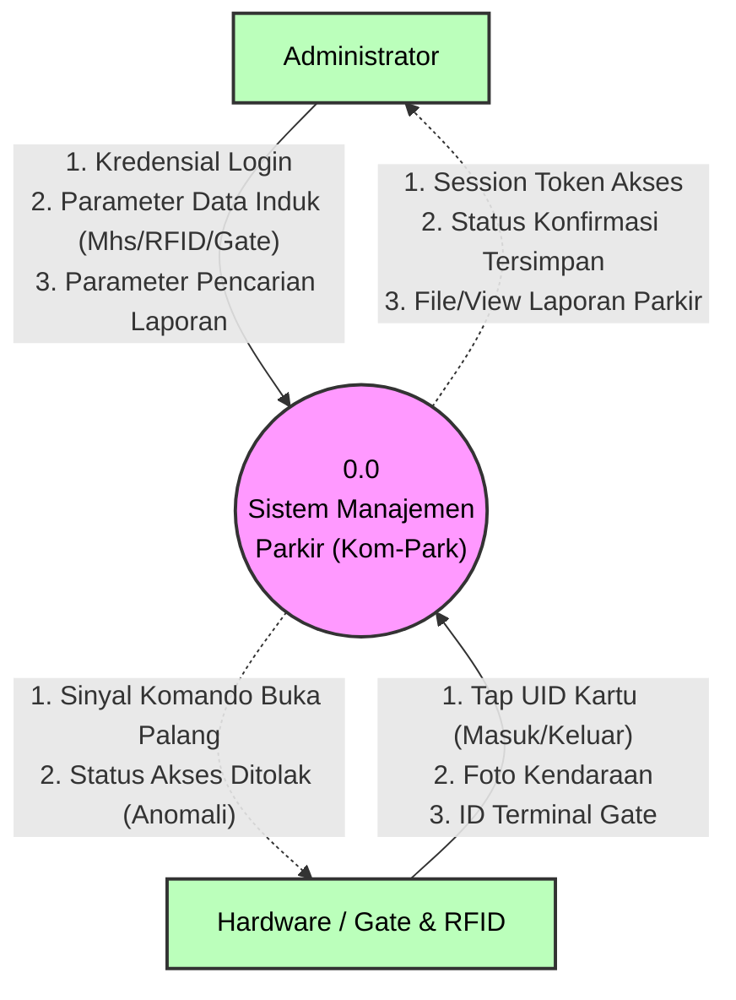

# DFD Level 0 (Context Diagram) - Kom-Park

DFD Level 0 atau **Diagram Konteks** memberikan gambaran sistem secara keseluruhan dari sudut pandang paling luar *(bird's-eye view)*. Pada level ini, **Data Store (Database) sengaja tidak ditampilkan** karena database itu sendiri adalah bagian tertutup dari keseluruhan entitas sistem.

Diagram ini menyoroti bagaimana dua entitas eksternal kita saling melempar input dan output mendasar kepada seluruh Sistem Kom-Park.

### Kamus Data Context Diagram:

- **Entitas Sistem (0.0)**: Kotak hitam *(black-box)* dari keseluruhan baris kode perangkat lunak Kom-Park. Sistem menyembunyikan perhitungan rumitnya di tahapan level ini.
- **Entitas Administrator**: Sumber penggerak administrasi manusia. Hanya bisa saling bertukar rekam data mentah *(Input Kelola data, Output Konfirmasi Laporan).*
- **Entitas Hardware**: Merupakan "mata, telinga, dan anggota tubuh fisik" sistem di lapangan. Menyuplai sensor (*UID kartu & Foto*) kepada sistem pusat, lalu menerima instruksi balik (*Angkat Palang Pintu*) dari sistem pusat.
