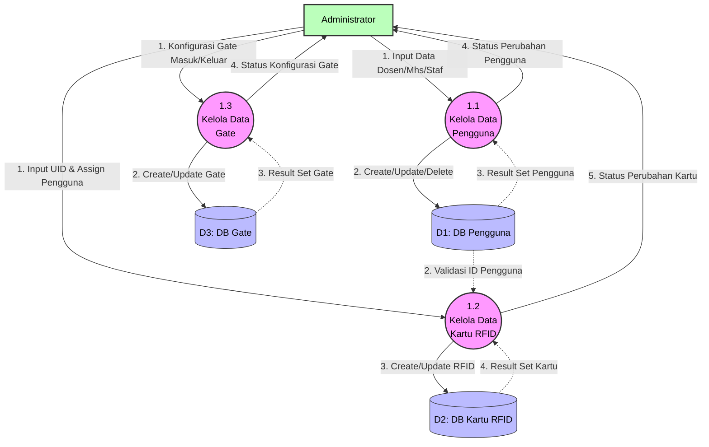

# DFD Level 2 - Proses 1.0 (Manajemen Data Induk)

Diagram ini merupakan rincian (dekomposisi) dari proses Manajemen Data Induk pada DFD Level 1. Proses memecah manajemen antara data Pengguna, Kartu RFID, dan Terminal Gate.

### Kamus Data Proses 1.0:
- **1.1 Kelola Data Pengguna**: Mengatur rekam jejak pengguna parkir *(Mahasiswa, Dosen, Staf)*. Administrator mengisi atau menghapus nama dan NIM/NIP.
- **1.2 Kelola Data Kartu RFID**: Proses ini mengaitkan kartu fisik dengan akun di D1. Tanpa adanya validasi pengguna di D1, kartu tidak akan bisa di-*assign*.
- **1.3 Kelola Data Gate**: Setup metadata gerbang secara logis (cth: "Gate Timur", "Tipe Keluar"). Ini penting agar *log parkir* tahu darimana kendaraan lewat.
