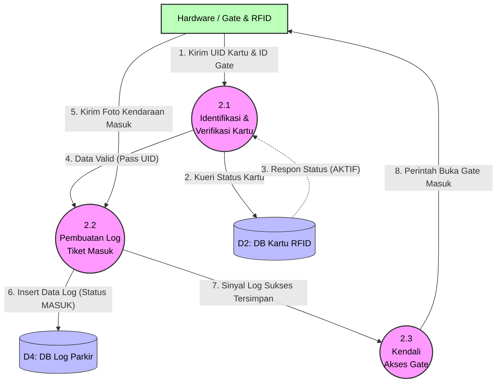

# DFD Level 2 - Proses 2.0 (Pencatatan Masuk Parkir)

Diagram ini mendekomposisi alur check-in kendaraan. Titik pemicunya adalah sensor perangkat keras saat menangkap UID Kartu.

### Kamus Data Proses 2.0:
- **2.1 Identifikasi & Verifikasi Kartu**: Bertindak sebagai satpam sistem. Menolak mentah-mentah jika `uidKartu` belum teregistrasi, kedaluwarsa, atau berstatus *HILANG*.
- **2.2 Pembuatan Log Tiket Masuk**: Ketika lolos dari 2.1, proses ini mencatat riwayat ke `LogParkir` (D4). Waktu kedatangan (*waktuMasuk*) terbentuk secara otomats.
- **2.3 Kendali Akses Gate**: Menerjemahkan sirkuit logika sukses dari database (D4) menuju sinyal komando agar palang pintu fisik terangkat.
