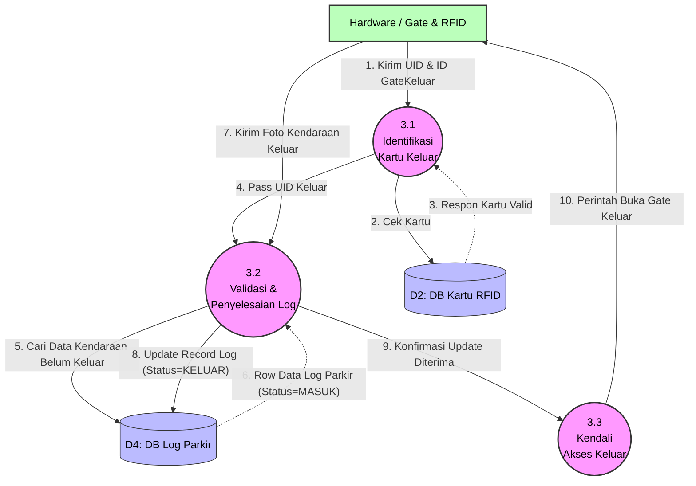

# DFD Level 2 - Proses 3.0 (Pencatatan Keluar Parkir)

Diagram ini menguraikan dekomposisi alur check-out kendaraan. Sistem wajib memastikan kendaraan benar-benar pernah masuk terlebih dahulu sebelum bisa keluar.

### Kamus Data Proses 3.0:
- **3.1 Identifikasi Kartu Keluar**: Memverifikasi kondisi kartu saat ini, apakah masih aktif atau di-suspend ketika pemilik sedang di dalam area (contoh: kartu tiba-tiba di-*disable* oleh Admin).
- **3.2 Validasi & Penyelesaian Log**: Inilah proteksi sistem anti-anomali. Jika UID `A` mencoba menempel keluar *tanpa* log pernah masuk sebelumnya, proses akan ditolak atau ditandai anomali. Apabila ada kecocokan, tabel (D4) akan diperbarui `waktuKeluar` dan statusnya ditutup.
- **3.3 Kendali Akses Keluar**: Pelatuk perangkat keras untuk membuka gerbang *outbound*.
