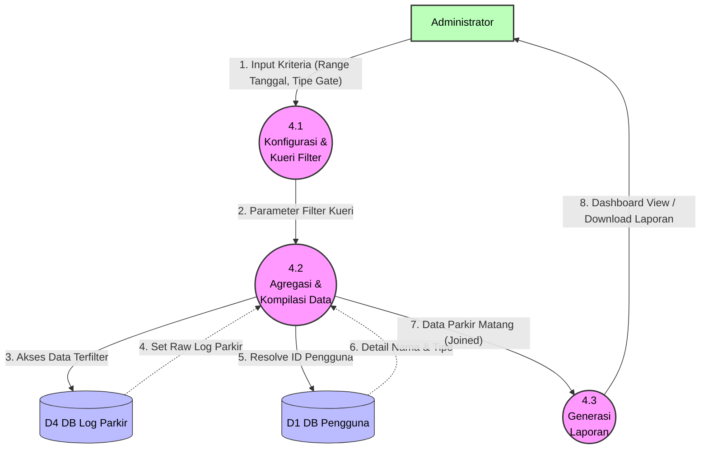

# DFD Level 2 - Proses 4.0 (Pembuatan Laporan)

Proses ini menangani sisi manajerial di mana Administrator melakukan agregasi data dan pelaporan mengenai aktivitas parkir dalam sistem.

### Kamus Data Proses 4.0:
- **4.1 Konfigurasi & Kueri Filter**: Menerima input kriteria visual dari UI, misalnya Administrator ingin melihat parkir dari tanggal *1 April - 30 April*.
- **4.2 Agregasi & Kompilasi Data**: Sub-proses terberat yang melakukan JOIN SQL (atau `include` jika di Prisma). Data murni dari `LogParkir` (D4) akan dirajut dengan master `Pengguna` (D1) supaya laporan mencantumkan "Nama Pemilik Kartu".
- **4.3 Generasi Laporan**: Melakukan *formatting* *raw* JSON/objek tersebut menjadi statistik Dashboard atau ekspor Excel/PDF.
