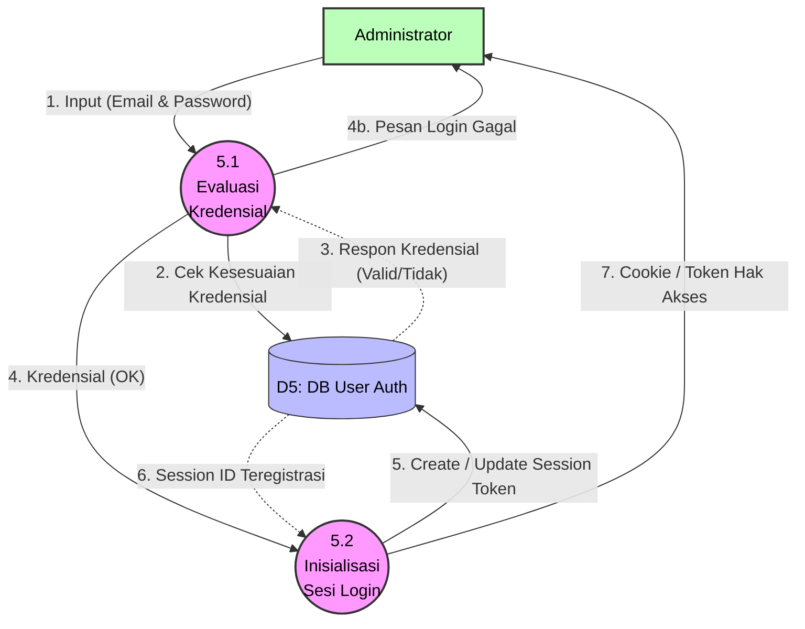

# DFD Level 2 - Proses 5.0 (Autentikasi Sistem)

Diagram ini menguraikan dekomposisi langkah keamanan yang wajib dilalui Administrator untuk mengamankan Data Parkir dan Manajemen Identitas.

### Kamus Data Proses 5.0:
- **5.1 Evaluasi Kredensial**: Memeriksa *email* dan mengomparasi *hash password* yang masuk dari kolom isian Administrator dengan database User Auth (D5).
- **5.2 Inisialisasi Sesi Login**: Otomatis menyimpan `token_session` yang unik bila kata sandi benar, untuk menjaga kondisi aktif pengguna (*stay-logged-in*) tanpa harus mengisi kata sandi terus saat berpindah menu.
